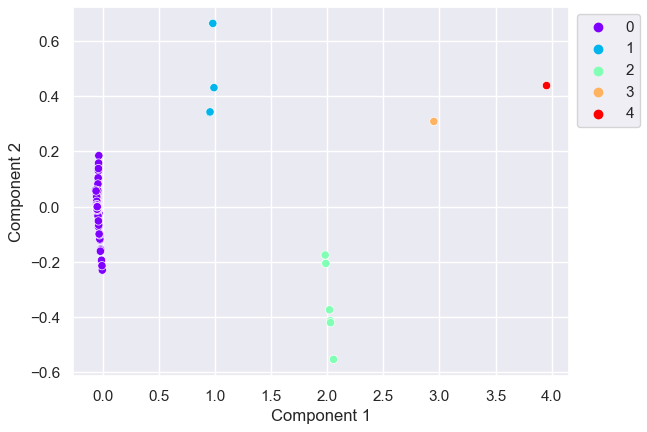
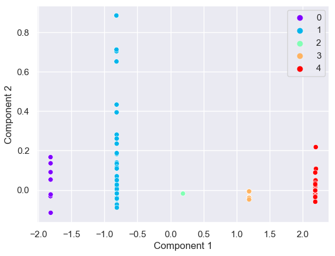
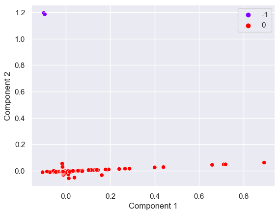
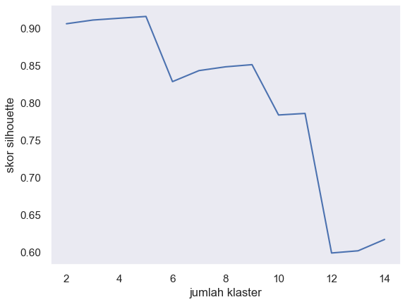
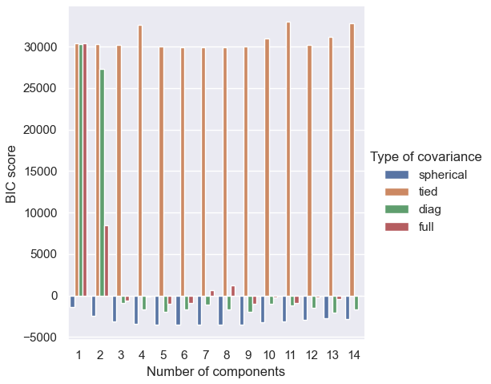
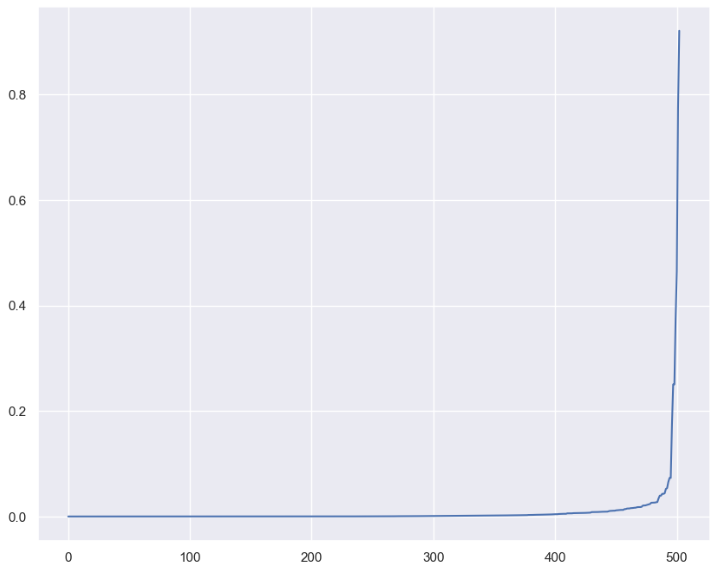
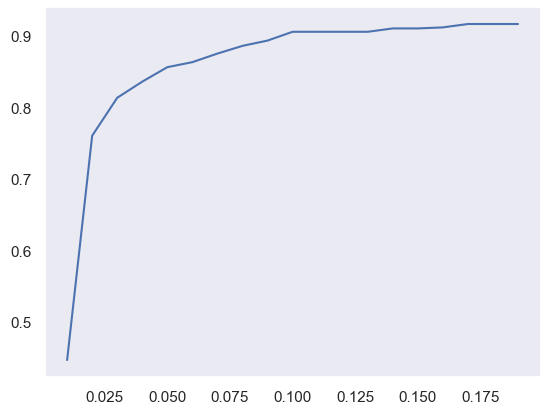
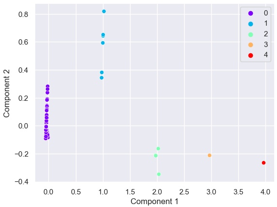
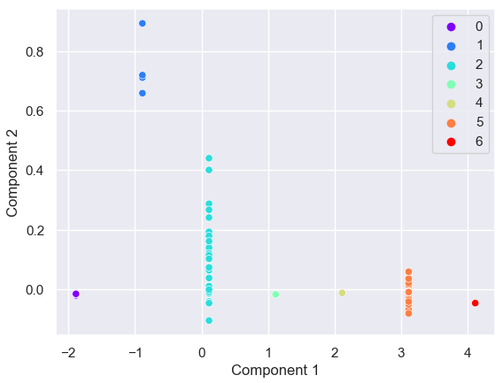
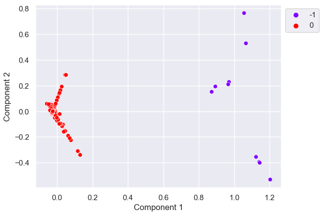

# **Penerapan Algoritma _Clustering_ untuk Pengelompokkan Saham IDX Berdasarkan Indikator-indikator Fundamental - Submission Machine Learning Terapan Dicoding**

oleh: Fikri Septrian Anggara (fikri_anggara_2c3r)

## 1. Domain Permasalahan

Ada berbagai cara untuk melakukan investasi seperti investasi tanah, properti, emas hingga barang yang tidak memiliki bentuk seperti saham. Belakangan ini investasi saham mulai digemari di Indonesia. hal itu terlihat dari bermunculannya platform dan aplikasi untuk investasi saham seperti Bibit, IPOT, Ajaib, dan sebagainya.

Ada dua jenis investor atau orang yang melakukan investasi, yaitu investor jangka panjang, dan investor jangka pendek. Investor jangka pendek tertarik dengan keuntungan jangka pendek dan investor jangka panjang tertarik dengan keuntungan jangka panjang. Ketika melakukan investasi jangka pendek, investor memilih/membeli saham dengan beberapa metode, mulai dari menebak-nebak hingga yang lebih formal yaitu analisis teknikal, di mana investor menganalisis data harga saham masa lalu dari suatu saham untuk memprediksi harga saham di masa depan sehingga investor tersebut bisa menentukan beli atau tidak. Investor jangka panjang juga memiliki metode untuk memilih/membeli suatu saham, mulai dari menebak-nebak hingga melakukan analisis fundamental, yaitu analisis yang bertujuan untuk mendapatkan nilai intrinsik suatu perusahaan dan membandingkannya dengan harga saham sekarang sehingga diketahui apakah saham tersebut undervalue atau overvalued, dan memutuskan untuk membeli saham tersebut apabila undervalued dan menghindari apabila overvalued. Berbeda dengan analisis teknikal yang menggunakan data saham masa lalu, analisis fundamental tertarik dengan kondisi keuangan perusahaan.

Dunia kecerdasan artifisial (_artificial intelligence_) semakin berkembang tak terkecuali pada ranah finansial dan dunia persahaman. Sudah banyak penerapan algoritma _machine learning_ pada analisis teknikal untuk memprediksi harga saham yang memudahkan investor awam atau mahir untuk memilih saham yang akan dibeli. Meskipun begitu, masih belum banyak pembuatan model yang bertujuan untuk membantu melakukan analisis fundamental keungan perusahaan untuk investasi jangka panjang. Analisis fundamental cenderung lebih sulit dilakukan untuk investor pemula karena banyaknya item-item pada laporan keuangan maupun sepak terjang perusahaan tertentu untuk dianalisis.

Pada penelitian ini, dilakukan pendekatan _machine learning_ untuk membantu investor dalam melakukan analisis fundamental melalui pengelompokkan saham-saham perusahaan di Indonesia berdasarkan indikator-indikator fundamental untuk kemudian diharapkan dapat membantu memilih saham yang akan diinvestasikan.

Penelitian ini menggunakan beberapa algoritma dalam upaya pengelompokkan saham yang terdaftar pada Bursa Efek Indonesia (BEI/IDX) berdasarkan indikator fundamental, yaitu algoritma _Kmeans_, _Gaussian Mixture Models_ (GMM), dan _Density-Based Spatial Clustering of Application with Noise_ (DBSCAN). Dari penelitian ini diperoleh hasil bahwa algoritma GMM merupakan algoritma terbaik untuk keseluruhan metrik evaluasi pada studi kasus ini, dengan skor silhouette 0.96, indeks Calinski-Harabasz 23261.81, indeks Davies-Bouldin 0.18.

## 2. Business Understanding

Dalama melakukan analisis fundamental, diperlukan keahlian untuk menganalisa kondisi perusahaan sehingga sampai pada kesimpulan apakah harga saham sekarang itu undervalued atau overvalued. Salah satu sumber yang digunakan pada analisis ini yaitu laporan keuangan (_financial statement_). Terdapat banyak item pada laporan ini yang membuatnya sulit untuk dianalisis oleh investor awam.
Apabila seorang investor memiliki suatu saham dan telah menghasilkan keuntungan yang memuaskan, maka akan lebih mudah bagi investor tersebut untuk memilih saham lain yang berbeda apabila investor tesrebut mengetahui saham lain tersebut memiliki karakteristik yang mirip dengan saham yang telah dimiliki. Sebaliknya, apabila investor memiliki saham yang merugi, maka apabila investor tersebut mengetahui saham lain yang memiliki karakter yang sama dengan saham yang merugi, investor tersebut bisa menghindari saham dengan karakteristik yang sama.
Dengan model pengelompokkan saham berdasarkan karakteristik berupa indikator fundamental, investor dapat lebih mudah menentukan saham apa yang harus dihindari apabila diketahui merugi, dan saham apa yang berpotensi menghasilkan keuntungan.

### 2.1. Problem Statements

Berdasarkan permasalahan yang diuraikan sebelumnya, _problem statements_ dari proyek kali ini adalah sebagai berikut :

1. Apa saja indikator fundamental yang relevan untuk dianalisis ?

2. Bagaimana implementasi pengelompokkan data saham menggunakan pendekatan _clustering_ ?

3. Apa algoritma yang paling baik dalam mengelompokkan harga saham ?

### 2.2. Goals

Secara umum tujuan-tujuan yang hendak dicapai dari proyek ini adalah sebagai berikut :

1. Mengetahui indikator fundamental yang relevan untuk dianalisis

2. Mengetahui tahapan dalam upaya pengelompokkan data saham

3. Mengetahui algoritma yang paling baik dalam mengelompokkan data saham

### 2.3. Solution statements

Adapun solusi untuk menyelesaikan permasalahan tersebut adalah sebagai berikut :

1. Melakukan studi literatur untuk mengidentifikasi indikator indikator yang relevan
2. Melakukan pembangunan model dengan tahapan mulai dari _data undestanding_, _data preparation_, _modeling_, dan _model evaluation_.
3. Membandingkan berbagai algoritma _clustering_ --yang sudah dilakukan _tuning_ sehingga diperoleh model terbaik untuk setiap algoritma-- dengan metrik evaluasi skor silhouette, indeks Calinski-Harabasz, dan indeks Davies-Bouldin; ambil model dengan metrik evaluasi terbaik.

## 3. Data Understanding

### 3.1. Menyiapkan Dataset

dataset diperoleh dari kaggle, terdapat dua dataset yang digunakan yaitu:

- [financial statement idx stocks](https://www.kaggle.com/datasets/greegtitan/financial-statement-idx-stocks?resource=download) (kaggle). terakhir diupdate pada Oktober 2022.
- [daftar saham](https://www.kaggle.com/datasets/muamkh/ihsgstockdata?select=DaftarSaham.csv) (kaggle). terakhir diupdate pada Januari 2023

data yang digunakan pada financial statement idx stock ialah data laporan keuangan pada kuarter 2022-03-31.

#### 3.2. Overview Data :

```
- Datasets Name :  quarter.csv
- Data Overall : 208691 rows x 8 Column
- Source : Kaggle
- Link : https://www.kaggle.com/datasets/greegtitan/financial-statement-idx-stocks?resource=download
- License : Unknown
```

```
- Datasets Name :  DaftarSaham.csv
- Data Overall : 829 rows x 14 Column
- Source : Kaggle
- Link : https://www.kaggle.com/datasets/muamkh/ihsgstockdata?select=DaftarSaham.csv
- License : Unknown
```

Pada tahap _Overview Data_ dilakukan pemeriksaan informasi _dataset_, pengecekan _null value_, analisis _5 number summary of statistic_, dan pengecekan struktur data.

Hasil dari \_data undestanding diperoleh informasi sebagai berikut.

_dataset_ **quarter.csv** memiliki 208691 baris dan 8 kolom. ke delapan kolom yaitu :

- **symbol**: Kode saham IDX seperti BBRI, BBCA, BMRI, dst.
- **account**: Akun laporan keuangan. nilainya meliputi **BS** untuk _Balance Sheet_, **IS** untuk akun _Income Statement_, dan **CF** untuk akun _Cash Flow_.
- **type**: Tipe/variabel laporan keuangan seperti data total aset, kredit, dividen yang dibayarkan, dst. memiliki 388 tipe.
- Kolom data variabel laporan keuangan perkuarter. meliputi tanggal **2021-09-30**, **2021-12-31**, **2022-03-31**, **2022-06-30**, **2022-09-30**.

_dataset_ **daftarSaham.csv** memiliki 829 baris dan 14 kolom. ke empat belas kolom tersebut yaitu:

- **Code**: Kode saham IDX
- **Name**: Nama saham
- **ListingDate**: Tanggal pendaftaran saham
- **Shares**: Total saham beredar
- **ListingBoard**: Tingkat pasar saham, meliputi tingkat akselerasi, pengembangan dan utama
- **Sector**: Sektor perusahaan
- **LastPrice**: Harga terakhir saham
- **MarketCap**: Total nilai perusahaan
- **MinutesFirstAdded**: Menit pertama data ditambahkan
- **MinutesLastUpdated**: Menit terakhir data diperbarui
- **HourlyFirstAdded**: Jam pertama data ditambahkan
- **HourlyLastUpdated**: Jam terakhir data diperbarui
- **DailyFirstAdded**: Tanggal Pertama data ditambahkan
- **DailyLastUpdated**: Tanggal Terakhir data diperbarui

berdasarkan pengecekan _null value_, dan 5NSS diketahui :

- Terdapat banyak **null value** pada data saham perkuarter
- Terdapat **544** buah saham yang tercatat laporan keuangannya
- Terdapat **388** variabel pada laporan keuangan
- Terdapat **3** kategori akun yaitu balance sheet, cash-flow dan income statement
- Terdapat **11** sektor pada master stok dengan **Consumer Cyclicals** adalah sektor yang paling banyak emitennya
- Terdapat total **829** buah saham
- Terdapat **389** item pada laporan keuangan

pada tahap ini penulis tidak banyak melakukan eksplorasi data karena dataset awal belum tepat untuk dianalisis eksploratif.

## 4. Data Preparation

Dataset **quarter.csv** masih belum memiliki struktur yang bisa digunakan untuk pembuatan model dan belum digabung dengan masterStock untuk memperoleh data sektor.
Maka pada ada tahap _Data Preparation_, penulis :

1. merubah struktur data stockQuarter agar cocok untuk pembangunan model klaster
2. menggabungkan data stockQuarter dan masterStock
3. melakukan _feature engineering_ untuk memperoleh indikator fundamental yang digunakan [[1]](https://www.researchgate.net/publication/357600692_Examining_the_effectiveness_of_fundamental_analysis_in_a_long-term_stock_portfolio)
4. melakukan _feature selection_
5. melakukan analisis data eksploratif
6. melakukan imputasi pada fitur

karena data stockQuarter terbaru (2022-09-30) memiliki paling banyak _null value_, maka penulis menggunakan data kuarter sebelumnya, yaitu data kuarter kedua tahun 2022.

### 4.1. Mengubah Struktur data

Pada tahap ini, penulis merubah struktur data dengan memecah kolom tipe yang nantinya akan digunakan sebagia fitur menjadi kolom tersendiri, dan baris _dataframe_ merupakan _record_ untuk tiap saham.

### 4.2. Menggabungkan data

pada tahap ini, penulis menggabungkan daftarSaham.csv dengan quarter.csv untuk memperoleh sektor perusahaan tiap saham, harga saham terbaru, dan banyaknya saham beredar.

### 4.3. _Feature Engineering_ indikator fundamental

berdasarkan paper [[1]](https://www.researchgate.net/publication/357600692_Examining_the_effectiveness_of_fundamental_analysis_in_a_long-term_stock_portfolio), terdapat 5 indikator keuangan yang mampu mewakili indikator lain, yaitu:

- **Net Profit Margin**: perbandingan antara net profit/income dengan total revenue. Melihat apakah pengelolaan perusahaan menghasilkan cukup laba dan apakah biaya operasional dan apakah terdapat biaya yang berlebihan.<br>
  `Net profit margin = net income / total revenue`
- **Debt to equity ratio (D/E)** : perbandingan antara total kewajiban (_liabilities_) dengan ekuitas pemegang saham (_shareholder equity_)<br>
  `debt to equity ratio (D/E)= total debt / stockholder equity`
- **Current Ratio**: perbandingan antara aset yang dimiliki dengan kewajiban. menunjukkan kemampuan perusahaan melunasi utang jangka pendek dengan aset lancarnya. <br> `Current Ratio = current Assets (cash dan cash equivalents, accounts receivables, Available For Sale Securities) / Current liability ( di kasus ini hanya account payable, Current Notes Payable, Income Tax Payable, Trading Liabilities)`
- **Earning per share (EPS)**: perbandingan laba/profit (net income) setelah dikurangi pajak dengan jumlah saham yang beredar (outstanding shares). Digunakan untuk melihat profitabilitas perusahaan. Outstanding Shares diperoleh dari Share Issued - Treasury Shares Number. <br> `EPS = Net Income / (share issued - treasury shares number)`
- **P/E Ratio**: perbandingan antara harga perlembar saham dengan laba tahunan perlembar (EPS). Untuk membandingkan nilai relatif antar perusahaan. <br> ` P/E ratio = share price/EPS`

### 4.4. _Feature Selection_

Untuk pembangunan klaster, penulis hanya menggunakan indikator fundamental yang diperoleh dari hasil rekayasa fitur. selain itu penulis menambahkan kode, nama perusahaan dan sektor perusahaan. keseluruhan fitur yang digunakan ialah:

- **Code**
- **Name**
- **Sector**
- **Net Profit Margin**
- **Debt to Equity Ratio**
- **Current Ratio**
- **Earning per Share**
- **Price to EPS**

### 4.5. _Exploratory Data Analisis_ (EDA)

- Pemeriksaan null value
  
  ​ Gambar 1. _Persentase null value setiap fitur_
  Berdasarkan gambar 1, diketahui bahwa fitur DE, CR, EPS, dan P\S memiliki null value. null value tersebut bisa diakibatkan karena ada komponen penyusun indikator yang tidak memiliki nilai. tidak adanya nilai tersebut bisa jadi dikarenakan pelaporan keuangan saham belum lengkap, atau saham tersebut sudah tidak melantai di BEI.

- Pemeriksaan distribusi data menggunakan boxplot.
  
  
  

  

  gambar 2. _distribusi indikator per sektor_

Berdasarkan gambar 2, seluruh indikator memiliki pencilan baik atas maupun bawah. data outlier tentu akan mempengaruhi pembangunan klaster, namun penulis ingin agar semua saham yang datanya tersedia pada data laporan keuangan agar termasuk ke dalam pengelompokkan, sehingga penulis memutuskan untuk tidak membuang data outlier tersebut.


gambar 3. _distribusi saham per sektor_

Sektor yang paling banyak melantai pada BEI ialah sektor finansial yaitu sebesar 16.5% dari keseluruhan jumlah perusahaan dan paling sedikit sektor teknologi sebesar 2.8% dari keseluruhan jumlah perusahaan.


gambar 4. _matriks korelasi indikator_

Berdasarkan matriks korelasi, dapat terlihat bahwa tidak ada korelasi yang kuat (>0.75) di antar indikator fundamental. namun terdapat korelasi moderat pada indikator Eearning per Shares dan Current Ratio.

### 4.6. Imputasi Data

Dalam menangani _null value_, penulis melakukan imputasi data menggunakan median untuk tiap indikator. nilai median dipilih karena lebih _robust_ terhadap _outlier_ dibandingkan imputasi menggunakan rata rata.

### 4.7. _Scaling_ Data

Scalling data perlu dilakukan karena beberapa algoritma klaster dan tuning klaster sensitif terhadap skala data. Penulis menggunakan algoritma _min-max scaler_ untuk scaling data.

## 5. Modelling

Terdapat berbagai algoritma dalam membangun klaster peneliti menggunakan 3 buah algoritma, yaitu:

- **K-means**. Merupakan salah satu algoritma unsupervised paling sederhana yang digunakan untuk menyelesaikan berbagai masalah pengelompokan. Tujuan _clustering_ menggunakan Kmeans adalah mengelompokkan N sampel data ke dalam 𝐾𝐾 kategori. Ide dasar Kmeans adalah bahwa dengan pengelompokan awal tetapi tidak optimal, pindahkan setiap titik ke pusat terdekatnya yang baru, perbarui pusat pengelompokan dengan menghitung rata-rata titik anggota dan ulangi proses relokasi dan pembaruan sampai kriteria konvergen terpenuhi [[2]](https://www.sciencedirect.com/science/article/pii/S1877050922022207).
- **GMM**. Gaussian Mixture Model (GMM) adalah model probabilistik yang mengasumsikan semua titik data dihasilkan dari campuran sejumlah distribusi Gaussian dengan parameter yang tidak diketahui. Seseorang dapat menganggap model campuran sebagai generalisasi pengelompokan k-means untuk memasukkan informasi tentang struktur kovarians data serta pusat-pusat Gaussian laten.
- **DBSCAN**. DBSCAN adalah algoritma pengelompokan unsupervised yang mengandalkan gagasan cluster berbasis kepadatan
  dirancang untuk menemukan cluster yang memiliki bentuk beragam. Algoritma ini membutuhkan dua input yaitu minPts dan eps
  (radius). Objek dengan tetangga lebih dari minPts dalam radius dianggap sebagai titik inti. Semua tetangga di dalam
  jari-jari ε dari titik inti dipertimbangkan dalam cluster yang sama dengan titik inti (disebut kepadatan langsung yang dapat dijangkau). Bukan inti
  titik dalam klaster ini disebut titik perbatasan, dan semua titik dalam klaster yang sama memiliki kepadatan yang terhubung. Poin
  yang kepadatannya tidak dapat dijangkau dari titik inti mana pun yang diberi label sebagai noise (pencilan, bukan milik kluster mana pun) [[2]]((https://www.sciencedirect.com/science/article/pii/S1877050922022207))

### 5.1. _Modelling_ Tanpa _Tuning Hyperparameter_

pada tahap ini penulis melakukan pembangunan klaster untuk masing masing algoritma tanpa tuning hyperparameter. penulis mengambil nilai random sebagai hyperparameter masing masing algoritma. Dalam mevisualisasi data, penulis menggunakan PCA untuk mereduksi dimensi data menjadi 2 dimensi kemudian me-plot data menggunakan scatter plot dengan sumbu x dan y adalah principal component ke 1 dan 2



gambar 5. _hasil klaster Kmeans tanpa tuning (jumlah klaster = 5)_



gambar 6. _hasil klaster GMM tanpa tuning (banyak komponen = 5)_



gambar 7. _hasil klaster DBSCAN tanpa tuning (epsilon = 0.5, min sampel = 5)_

Berdasarkan hasil visualisasi _scatterplot_, terlihat bahwa pengelompokkan GMM dan Kmeans kurang lebih memiliki varians intra klaster dan interklaster yang sama. pengelompokkan DBSCAN terlihat hanya berhasil menangkap outlier (klaster berwarna ungu). Evaluasi formal menggunakan metrik evaluasi akan dilakukan di tahap akhir analisis.

### 5.2. _Hyperparameter Parameter Tuning_

#### 5.2.1. _Tuning Kmeans_

Pada Kmeans hyperparameter yang perlu dituning ialah banyaknya kluster. Di tahap ini penulis melakukan tuning Kmeans dengan perhitungan skor silhouette untuk jumlah klaster yang berbeda [[2]](https://www.sciencedirect.com/science/article/pii/S1877050922022207). Semakin tinggi skor silhouette, semakin baik.



Berdasarkan plot jumlah klaster vs skor silhouette, skor terbaik berada pada jumlah klaster = 5 dengan skor silhouette sebesar 0.915.

#### 5.2.2. _Tuning GMM_

Pada Kmeans hyperparameter yang perlu dituning ialah banyaknya komponen dan tipe kovarians (spherical, tied, full, atau diagonal).
Tuning GMM dilakukan dengan teknik grid search untuk perhitungan _Bayesian Information Criterion_. setiap kombinasi banyak komponen dan tipe kovarians. Semakin rendah skor BIC, semakin baik.


gambar 8. plot skor banyak komponen per tipe kovarians vs skor BIC

| #   | Banyak Komponen | Tipe Kovarians | Skor BIC     |
| --- | --------------- | :------------: | ------------ |
| 0   | 7               |   Spherical    | -3543.070334 |
| 1   | 8               |   Spherical    | -3535.113480 |
| 2   | 5               |   Spherical    | -3520.730533 |
| 3   | 9               |   Spherical    | -3474.828378 |
| 4   | 6               |   Spherical    | -3474.385560 |

tabel 1. _5 Skor BIC untuk tiap kombinasi banyak komponen dan tipe kovarians terendah_

Berdasarkan tabel 1 dan gambar 8, diketahui bahwa kombinasi banyak komponen dan tipe kovarians yang paling mengoptimumkan skor BIC ialah **7** komponen dengan tipe kovarians **_spherical_**. untuk setiap kombinasi, tipe kovarians **_spherical_** merupakan tipe kovarians yang paling baik dalam mengelompokkan data yang digunakan.

#### 5.2.3. _Tuning DBSCAN_

Terdapat dua parameter yang perlu ditune di algoritma DBSCAN, yaitu epsilon dan sampel minimum.
menurut [[3]](https://link.springer.com/article/10.1023/A:1009745219419), sampel minimum yang paling optimal ialah 2 kali dimensi data. data yang digunakan memiliki 5 feature sehingga sampel minimum optimal yaitu 10 sampel.
sementara epsilon terbaik bisa dilihat dari bagian siku grafik elbow epsilon [[4]](https://iopscience.iop.org/article/10.1088/1755-1315/31/1/012012). Jarak antar data dihitung dengan metode _Nearest Neighbour_



gambar 9. _plot nilai epsilon_

berdasarkan gambar 9, siku grafik terdapat pada nilai epsilon antara 0.0 hingga 0.2. untuk mendapatkan epsilon terbaik yang lebih akurat, dilakukan perhitungan skor silouette untuk setiap epsilon yang berada di rentang tersebut dengan iterasi epsilon 0.01.



gambar 10. _plot skor silhouette_.

berdasarkan gambar 10, skor silhouette paling maksimal berada di antara 0.175 dan 0.2. penulis mengambil nilai 0.175.

### 5.3. _Modelling_ Dengan _Hyperparameter_ hasil _Tuning_

Pada tahap ini penulis mengulang proses yang sama dengan tahap **5.1.**, hanya saja dengan hyperparameter baru yang hasil _tuning_.



gambar 11. _klaster Kmeans hasil tuning_



gambar 12. _klaster GMM hasil tuning_



gambar 13. _klaster DBSCAN hasil tuning_

Berdasarkan visualisasi _scatterplot_, terlihat bahwa pengelompokkan GMM menjadi lebih baik. pengelompokkan DBSCAN masih menghasilkan 2 buah klaster, namun kali ini dengan komponen outlier yang lebih banyak. Evaluasi formal menggunakan metrik evaluasi akan dilakukan di tahap akhir analisis.

## 6. Evaluasi

Untuk mengevaluasi, baik model yang belum dituning dan sudah dituning, penulis menggunakan 3 metrik, yaitu:

- **Silhouette Score**. Skor ini memiliki rentang dari -1 hingga 1. skor -1 untuk klaster yang salah dan skor mendekati 1 menunjukkan suatu klaster memiliki stuktur yang rapat dan terpisah dengan baik.
- **Calinski-Harabasz Index**. Merupakan perbandingan antara jumlah persebaran antar klaster dan persebaran intra klaster. Skor yang tinggi menunjukkan model merupakan klaster yang baik.
- **Davies-Bouldin Index**. Indeks ini menghitung rata-rata kemiripan antar klaster, di mana kemiripan merupakan perbandingan jarak antara klaster dengan ukuran klaster itu sendiri. 0 merupakan nilai terendah, nilai indeks yang mendekati 0 merupakan klaster dengan partisi yang baik.

| #   | Algoritma | Skor Silhouette | Indeks Calinski-Harabasz | Indeks Davies-Bouldin |
| --- | --------- | :-------------: | ------------------------ | --------------------- |
| 0   | KMeans    |    0.956606     | 3423.564575              | 0.183594              |
| 1   | GMM       |    0.935965     | 16402.695119             | 0.154642              |
| 2   | DBSCAN    |    0.948211     | 200.701770               | 0.589859              |

Tabel 2. _evaluasi klaster sebelum tuning_

| #   | Algoritma | Skor Silhouette | Indeks Calinski-Harabasz | Indeks Davies-Bouldin |
| --- | --------- | :-------------: | ------------------------ | --------------------- |
| 0   | KMeans    |    0.956245     | 3078.997508              | 0.186129              |
| 1   | GMM       |    0.960808     | 76911.771937             | 0.133063              |
| 2   | DBSCAN    |    0.949079     | 837.247205               | 0.650169              |

Tabel 3. _evaluasi klaster setelah tuning_

Berdasarkan tabel 2 dan 3, diketahui bahwa :

- secara umum algoritma GMM merupakan algoritma yang paling baik, baik sebelum dan sesudah dituning.
- secara rata-rata, terjadi peningkatan performa untuk algoritma GMM dan DBSCAN, sementara KMeans mengalami penurunan performa.
- peningkatan performa paling signifikan terjadi pada algoritma GMM, di mana skor silhouette naik 2% (dari 0.94 ke 0.96), indeks Calinski-Harabasz naik 47% (dari 16402.69 ke 76911.77) dan indeks Davies-Bouldin turun 14% (dari 0.13 ke 0.15)

## 7. Kesimpulan

Dari hasil penelitian, diketahui bahwa :

1. terdapat 5 indikator fundamental yang cukup untuk digunakan dalam melakukan analisis fundamental, yaitu **Net Profit Margin**, **Debt to Equity Ratio**, **Current Ratio**, **Earning per Share**, **Price to EPS**.
2. Semua indikator tersebut belum terdapat pada dataset yang digunakan sehingga dilakukan rekayasa fitur untuk memperoleh indikator fundamental. setelah dilakukan rekayasa fitur, penulis melakukan seleksi fitur, imputasi data, _scaling_ data, pembangunan model dengan dan tanpa tuning, hingga evaluasi model.
3. Dari hasil perbandingan dan tuning model _clustering_ **Kmeans, GMM, DBSCAN**, algoritma **GMM** hasil tuning merupakan algoritma yang paling baik dalam mengelompokkan data saham berdasarkan indikator fundamental.

### Referensi

[1] Csesznik, Z., Gaspar, S., Thalmeiner, G., Zoltan, Z. (2021). Examining the effectiveness of fundamental analysis in a long-term stock portfolio.Economic Annals-ХХI, 190, 119-127. [Online]. Tersedia: http://ea21journal.world/index.php/ea-v190-11/

[2] Pranata, K. S., Gunawan, A. A. S., Gaol, F. L. (2023). Development clustering system IDX company with k-means algorithm and DBSCAN based on fundamental indicator and ESG. Procedia Computer Science, 216, 319-327. [Online]. Tersedia: https://doi.org/10.1016/j.procs.2022.12.142

[3] Rahmah, N., & Sitanggang, I. S. (2016). Determination of Optimal Epsilon (Eps) Value on DBSCAN Algorithm to Clustering Data on Peatland Hotspots in Sumatra. IOP Conference Series: Earth and Environmental Science. 31. [Online]. Tersedia https://iopscience.iop.org/article/10.1088/1755-1315/31/1/012012
